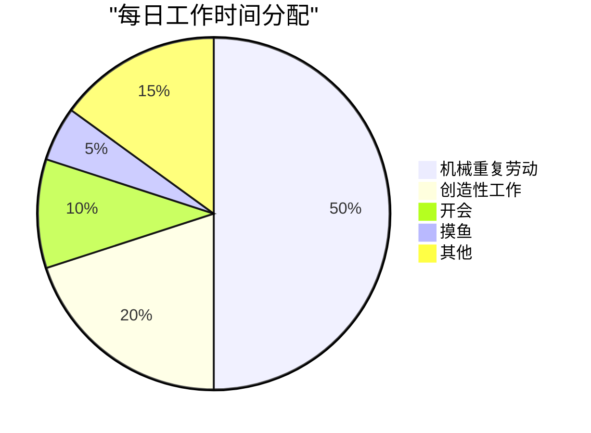
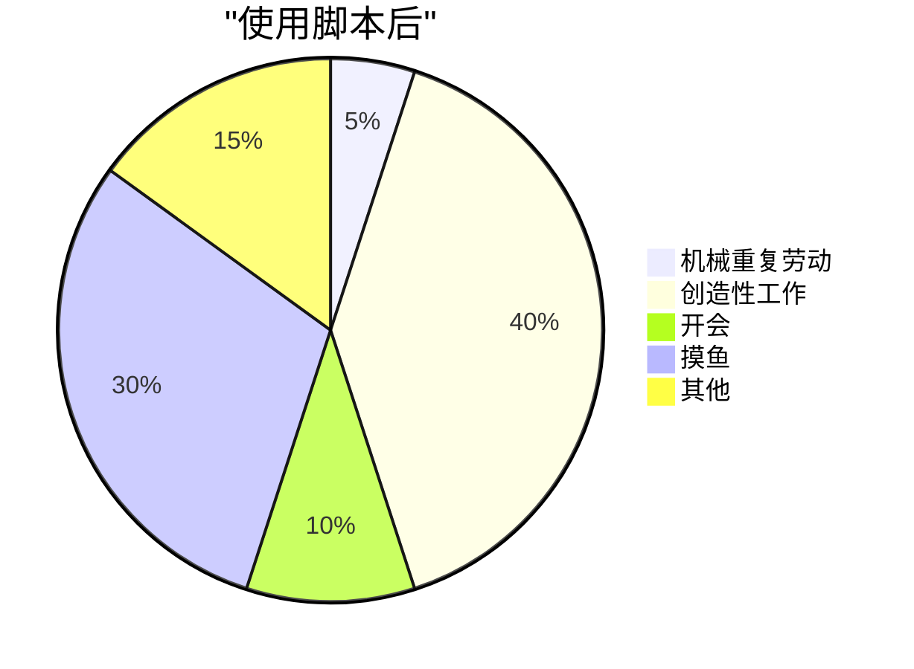

```mermaid
pie
  title "每日工作时间分配"
  "机械重复劳动" : 5
  "创造性工作" : 2
  "开会" : 1
  "摸鱼" : 0.5
  "其他" : 1.5

```

```mermaid
pie
  title "使用脚本后"
  "机械重复劳动" : 0.5
  "创造性工作" : 4
  "开会" : 1
  "摸鱼" : 3
  "其他" : 1.5
```
